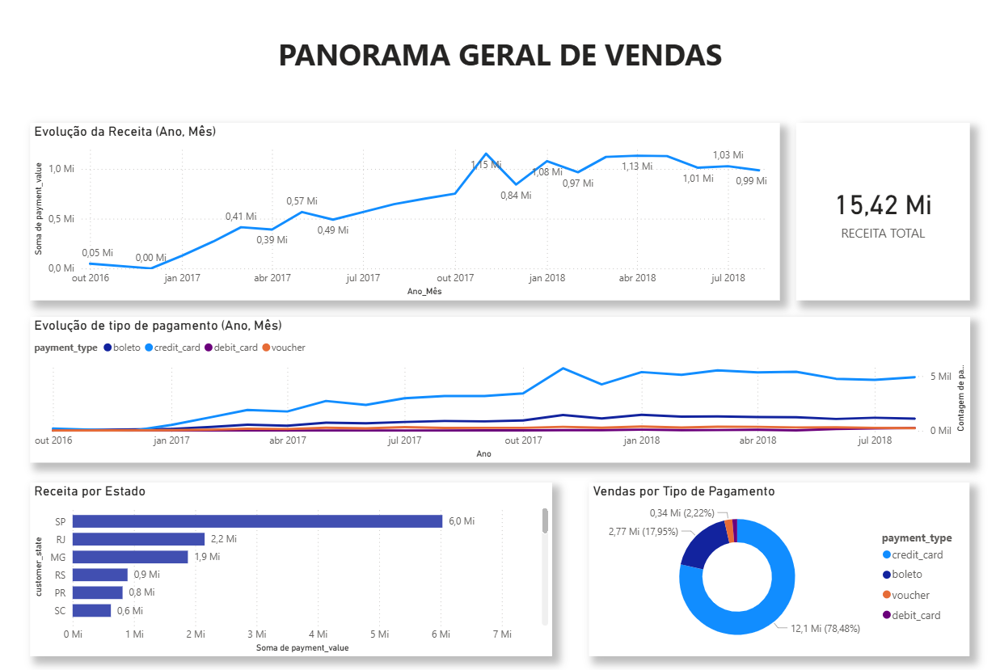
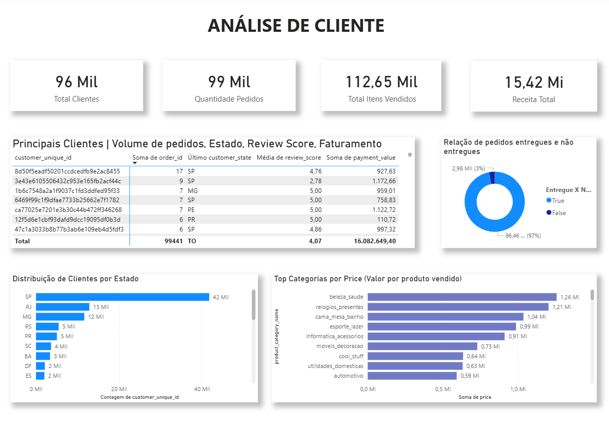
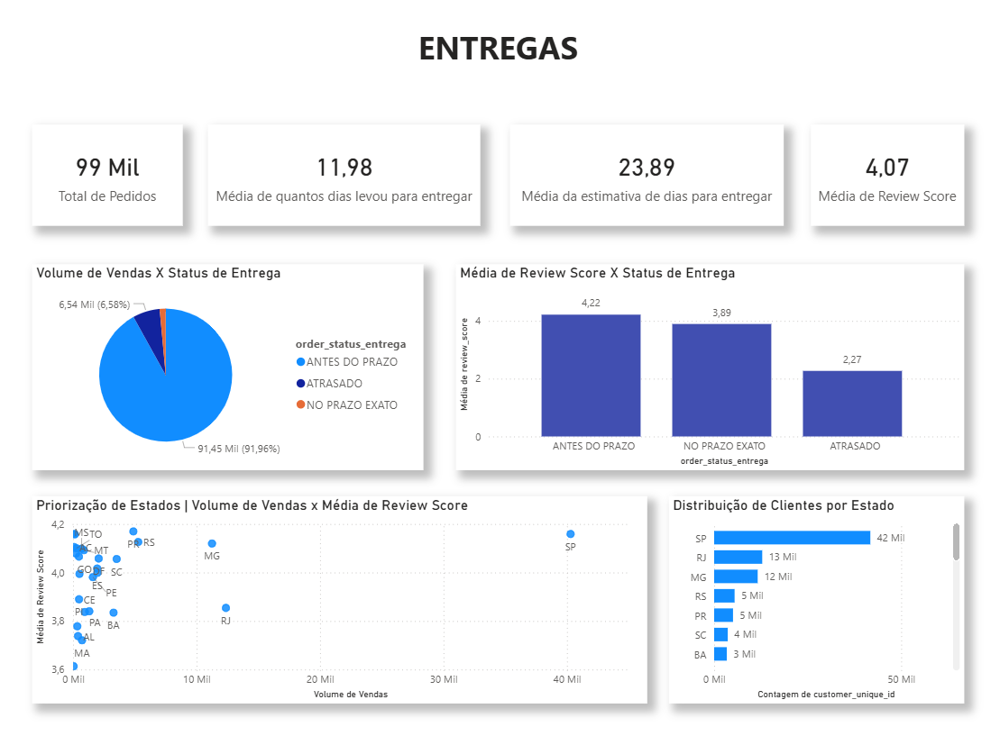
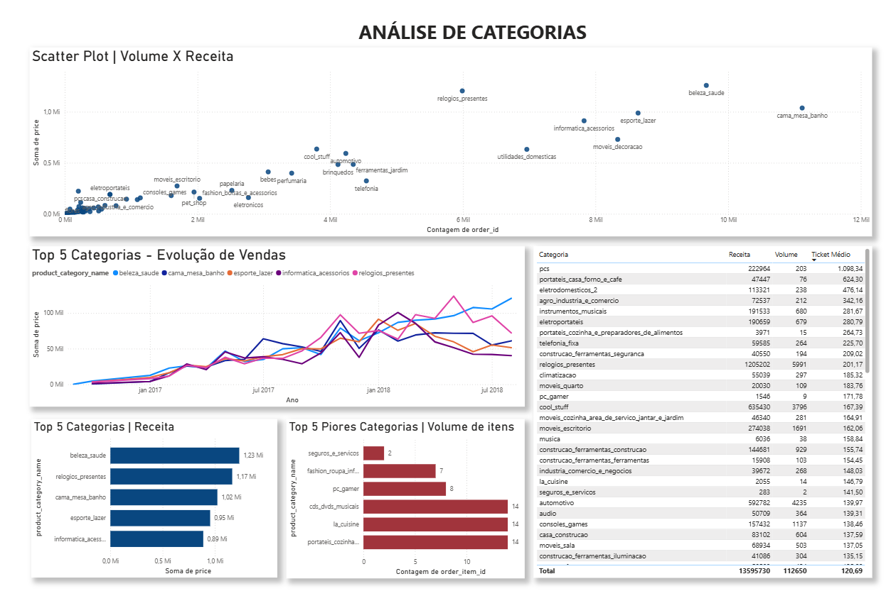
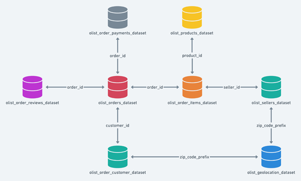

# Ánalise Exploratória de Dados -  OLIST (E-COMMERCE)

## Visão Geral e Contexto do Projeto
Análise Exploratória de Dados (EDA) no dataset público do e-commerce brasileiro **Olist**, com o objetivo de extrair insights estratégicos que auxiliem na otimização do portfólio de produtos, melhoria da experiência do cliente, refinamento da eficiência logística e operacional e identificação de oportunidades de crescimento. Para isso, foram utilizadas técnicas de limpeza e tratamento de dados, análise estatística, visualizações e modelagem de métricas.

A Olist é uma plataforma de tecnologia que conecta pequenos e médios comerciantes de todo o Brasil aos principais marketplaces do país. Com quase de 100 mil pedidos registrados entre 2016 e 2018.

## Dashboards 
| |  |
|---|---|
| |  |

## Pipeline de Dados
###  `Notebook Colab` - Limpeza e Preparação dos Dados + Confirmação de valores 
**ETL e Validação:** Preparação dos dados, limpeza e tratamento para o Power BI. Inclui verificações de consistência para garantir que os valores trabalhados no Power BI estejam alinhados com o dataset original.

[Visualizar notebook diretamente no GitHub](notebook/ETL__Validação_OLIST_publico.ipynb) 

> **Nota:** O notebook original utilizava um banco de dados SQL privado fornecido pela instituição Harve. Por questões de segurança, as credenciais foram removidas na versão publicada. A lógica de tratamento e análise permanece completa e pode ser replicada com os arquivos CSV públicos da Olist disponíveis no Kaggle.

---

## Principais Insights da Análise

### Panorama de Vendas

### 🏷️ Panorama Geral - Vendas e Receita
Contexto geral sobre o desempenho de vendas, servindo de base para as análises nas demais páginas.
- Sazonalidade: picos de vendas em **novembro e maio**
- **Cartão de crédito** é o meio de pagamento predominante.
- **SP, RJ, MG** concentram **65% da receita total** (R$ 10,1 Mi)
---

### Cliente 

### 🏷️ Insights - Priorização de Clientes

**Visão Geral**
- **96 mil clientes** cadastrados | **99 mil pedidos** realizados
- **Receita total:** R$ 15,42 Mi
- Apenas 3% dos pedidos **não foram entregues**

**Concentração Geográfica e Top Clientes**
- **SP** concentra **42% dos clientes** (maior base)
- **SP, RJ, MG** representam **65% do total de clientes**
- Cliente com maior frequência: **17 pedidos** (SP)

**Ações:**
- **Clientes com maior quantidade de pedidos estão concentrados nas regiões Sudeste e Sul.**  
  → **Ação:** Criar programas de fidelidade e campanhas personalizadas para essas regiões, já que concentram os clientes mais engajados.

- **Estados com maior receita possuem maior quantidade de clientes.**  
  → **Ação:** Manter e fortalecer a operação nesses estados (SP, RJ, MG), garantindo estoque, logística e atendimento de qualidade para não perder essa base. 
  → **Ação:** Monitorar tempo de entrega nesses estados para evitar baixa da review score.
  
- **Apenas 3% dos pedidos não foram entregues.**  
  → **Ação:** Monitorar de perto os casos de não entrega, especialmente nos estados com maior volume, para evitar impacto na satisfação nos estados com maior receita.

---

### Entregas

### 🏷️ Insights - Satisfação por Estado e Eficiência nas Entregas
- A partir do scatter plot de volume de vendas por estado e média de review score podemos fazer um diagnóstico estratégico por estado e classificar eles em 4 grupos, permitindo priorizar ações com base em dados.
  - `Alto Volume | Alta Review Socore`: Estados que vendem muito e os clientes estão satisfeitos. Manter foco e investimento. 
  
  - `Alto Volume | Baixa Review Score`: Estados que vendem muito mas algo está errado. Investigar fatores que estão baixando a satisfação. 
  
  - `Baixo Volume | Alto Review Score`: Estados com baixo volume mas satisfação alta. Possibilidade de expansão de mercado 
  
  - `Baixo Volume | Baixo Review Score`: Estados de baixa prioridade. Avaliar continuidade das operações. 

**Ações:**
- **A média do review score está diretamente relacionada ao cumprimento do prazo de entrega: entregas antes do prazo têm nota média de 4,22, enquanto entregas atrasadas caem para 2,27.**
→ **Ação:** Reduzir o tempo de entrega nessas regiões é um caminho direto para aumentar a satisfação. Estados com alto volume de vendas e baixa review score podem ter o problema associado a atrasos na logística.

- **Média de quantos dias levou para entregar o produto (11,98 dias) menor do que a média da expectativa (23,89 dias):**
→ **Ação:** É um ponto positivo para a operação pois, em média, as entregas estão sendo feitas em metade do tempo estimado. Porém, é necessarío olharmos para os estados com alta demanda e baixa review score, pode ser que nesses locais específicos a realidade seja diferente da média geral.

---

### Ánalise de Categorias

### 🏷️ Insights - Relação de Volume de Categorias e Contribuição para a Receita
- Ao analisar o scatter plot com **Volume de Itens Vendidos X Receita por Categoria** e a tabela com ticket médio podemos classificar as categorias em grupos estratégicos e direcionar ações de negócio:
  - `Volume Alto | Receita Alta`: Categorias campeãs, mais vendem e mais faturam. Manter investimento, garantir estoque e variedade. 
  
  - `Baixo Volume | Receita Alta`: Categorias exclusivas, Ticket elevado mas vendem menos. Manter exclusividade e investir em campanhas direcionadas para esse público nichado. 
  
  - `Volume Alto | Receita Baixa`: Categorias populares, alto volume de vendas mas Ticket baixo. Focar em upsell e cross-sell aproveitando o fluxo de volume já existente.  
  
  - `Volume Baixo | Receita Baixa`: Categorias a serem reavaliadas. Estudar reposicionamento ou descontinuamento. 

---
## Modelagem de Dados - Tabelas e relacionamentos
Relacionamento entre as tabelas no Power BI, seguindo o modelo estrela (Star Schema) para otimizar a performance e a criação de medidas DAX.

  

## 🛠️ Tecnologias e Ferramentas Utilizadas
**Google Colab (Python)**
- Ambiente principal para análise exploratória, limpeza e tratamento dos dados.

**Pyhton (Bibliotecas)**
- `pandas`, `sqlalchemy`

**Power BI**
- `Power Query` → Limpeza e conversão de dados
- `DAX` → Criação de Medidas e Métricas 
- `Dashboard` com os principais insights

## 👤 Autoria e Desenvolvimento
Sofia Fernandes Job Junqueira 📫 [sofiafjob@gmail.com](mailto:sofiafjob@gmail.com)

**Dataset:** Olist Public Dataset (2016-2018) – dados anonimizados da e-commerce brasileira, disponível publicamente no Kaggle. O acesso foi realizado via banco de dados SQL montado para fins educacionais pela Instituição Harve.
